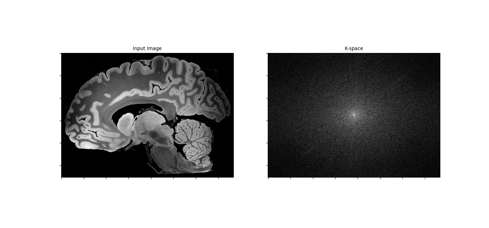
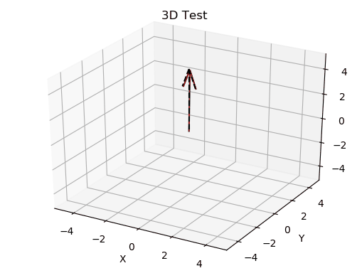
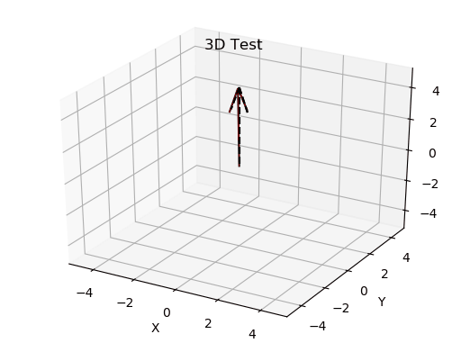

### Team number: 18

## Team members
- **Mostafa Amr**
- **Mostafa Abdelmohsen**
- **Adel Refaat**
- **Kirolos Dawood**

# Introduction 
Using Larmor frequency we are trying to Find the difference in angular frequency in hydrogen atoms 
after adding the nonuniformity effect to the Static Magnetic Field. 

# K-space (literature)
The K-space is defined by the space covered by the phase and frequency encoding data. 
By changing the gradient over time, the K-space data are sampled in a trajectory through Fourier space. 
Every point in the raw data matrix contains part of the information for the complete image. 

# K-space (python)
## libraries 
- CV2
- Matplot
- numpy.fft

## Code 
Using FFT and FFT as follows:

```python
img = cv2.imread('p2.jpg', 0)
dim = range(img.ndim)

k = fftshift(fftn(ifftshift(img, axes=dim), s=None, axes=dim), axes=dim)
k /= np.sqrt(np.prod(np.take(img.shape, dim)))
k = np.real(k)
magnitude_spectrum = 20 * np.log(np.abs(k) + 1)
```

## Result 


# Larmor frequency ( Literature)
The frequency of this spinning is the precessional / Larmor / rotational frequency. 
In MR imaging we induce precession by applying a magnetic field 
(conventionally in the Z axis and called B0, along the long axis of the patient). 
This magnetic field is permanently switched on in the MRI scanner.

The precessional frequency is calculated by the **Larmor Equation:**

#### F = K x B0 

**Where:**      
- F = precessional frequency (Larmor frequency)
- K = the gyromagnetic ratio (a constant that is different for     different nuclei)
- B0 = strength of the static magnetic field

# Larmor frequency (Python)
- Using B0 we got from the last task as a numpy array to store the nonuniform magnetic field we generated using a 
numpy function called **np.random.randint**.
- Multiplying it by the gyromagnetic ratio of hydrogen.
 - We get the difference in angular frequency between the molecules.

```python
gyromag_ratio = 42.6  # gyromagnetic ratio for the Hydrogen atoms
r = np.random.randint(16, 18, 90)
print(r * gyromag_ratio)  # List of different angular frequencies in MHz
```

## Result 
```python
# Different angular frequencies in MHz
[681.6 681.6 724.2 724.2 724.2 681.6 681.6 681.6 681.6 724.2 724.2 724.2
 681.6 681.6 724.2 681.6 681.6 681.6 724.2 681.6 681.6 681.6 681.6 681.6
 724.2 681.6 681.6 681.6 681.6 724.2 724.2 724.2 681.6 724.2 724.2 724.2
 681.6 724.2 681.6 681.6 724.2 681.6 681.6 724.2 724.2 724.2 681.6 681.6
 724.2 724.2 724.2 681.6 724.2 724.2 681.6 724.2 681.6 724.2 681.6 724.2
 724.2 724.2 681.6 681.6 724.2 681.6 681.6 681.6 681.6 724.2 724.2 724.2
 681.6 681.6 724.2 724.2 681.6 724.2 724.2 724.2 681.6 681.6 681.6 681.6
 724.2 724.2 681.6 724.2 681.6 724.2]
```

# Bulk magnetization’s trajectory
We created two GIF to explain the the bulk magnetization
-  first one (run **nonuniformity effect plotting2.py** to get this result) 
    - After applying the random magnetic field from task 1 in this task we get:




- Second one only for visualizing (run **nonuniformity effect plotting1.py** to get this result) 
    - We found that the first result is not clear enough so we made our random magnetic field manually in another 
    python file where the magnetic field increased rapidly till the trajectory reach the Z-axis.




